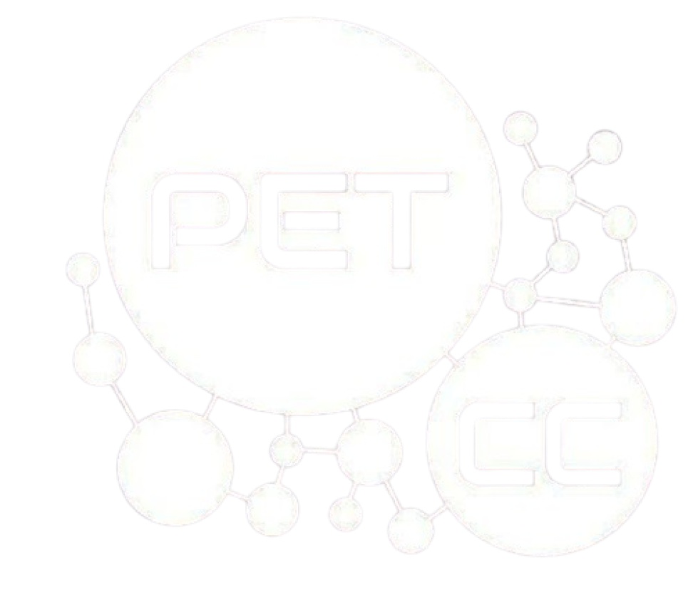

# {{ page.title }}

 

Bem-vindo ao site oficial do **Minicurso de Estruturas de Dados: C++ Aplicado**, ofertado pelo PET de Ciência da Computação da UFRN.

O Minicurso será ofertado no período de **03 a 07/08/2026**, com aulas das **8h às 12h**, no *LabEnsino* do Departamento de Informática e Matemática Aplicada (DIMAp), UFRN.

Durante esses cinco dias, iremos explorar conceitos fundamentais para qualquer pessoa que deseja evoluir na programação, participar de competições, se preparar para entrevistas técnicas ou simplesmente compreender melhor como o computador executa seus programas.

Você pode consultar o material das aulas já ministradas em [`/aulas`](https://petcc-ufrn.github.io/minicurso-estruturas-de-dados/aulas) e saber mais detalhes sobre a proposta do curso em [`/sobre`](https://petcc-ufrn.github.io/minicurso-estruturas-de-dados/sobre).



---

## Introdução ao curso

Olá a todos! Sejam muito bem-vindos ao curso de Estruturas de Dados e Algoritmos do PET-CC.

Você já se perguntou como listas, pilhas, filas ou árvores realmente funcionam por trás das bibliotecas prontas que usamos no dia a dia? Ou como o computador organiza os dados na memória para que um programa funcione de forma eficiente?

Neste curso, vamos “abrir a caixa-preta” das estruturas de dados e analisar como elas são implementadas e utilizadas na prática. Nosso objetivo não é apenas ensinar a usar ferramentas, mas entender profundamente:

- Como os dados são organizados na memória;
- Como diferentes estruturas impactam desempenho;
- Como analisar a eficiência de algoritmos;
- Como escolher a melhor estrutura para cada problema.

Ao longo das aulas, trabalharemos com exemplos práticos e problemas desafiadores, incentivando o raciocínio lógico e o pensamento computacional. Queremos que você desenvolva autonomia para projetar suas próprias soluções, entendendo os custos e benefícios de cada decisão tomada no código.

Mais do que aprender “o que usar”, queremos que você compreenda **por que usar**.

---

## Para quem é este curso?

O minicurso é voltado principalmente para:

- Estudantes que já tiveram contato inicial com programação;
- Alunos interessados em aprofundar seus conhecimentos além da sala de aula;
- Pessoas que desejam se preparar para maratonas de programação ou entrevistas técnicas;
- Qualquer pessoa curiosa sobre como os algoritmos realmente funcionam.

Não é necessário ser especialista — apenas ter disposição para pensar, testar, errar e aprender.

---

## O que você pode esperar

Ao final do minicurso, esperamos que você:

- Entenda os principais conceitos de estruturas de dados clássicas;
- Seja capaz de analisar a complexidade de um algoritmo;
- Tome decisões mais conscientes ao programar;
- Tenha uma base sólida para continuar estudando tópicos mais avançados.

---

## Programação do curso



---

&copy; PET-CC/UFRN 2025 Licenciado sob <a href="https://creativecommons.org/licenses/by-nc-sa/4.0/deed.pt-br">CC BY-NC-SA</a>.

